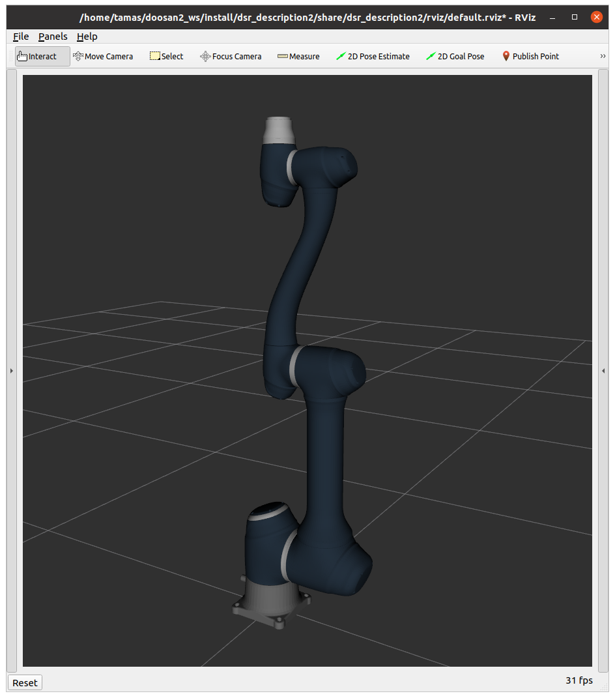

# 07. Kinematics, inverse kinematics, Programming of a simulated robotic arm


---

## Repetition

---


### 3D transformations

---


- **Position:** 3 element offset vector

{:style="width:250px" align=right}

- **Orientation:** 3 x 3 rotation matrix
    - additional orientation representations: Euler angles, RPY, angle axis, quaternion

- **Pose** (pose): 4 × 4 transformation matrix
- **Coordinate system** (frame): zero point, 3 axis, 3 base vector, right-hand rule
- **Homogeneous transformations:** rotation and translation together
    - e.g. $\mathbf{R}$ for rotation and $\mathbf{v}$ for translation:

$$
\mathbf{T} = \left[\matrix{\mathbf{R} & \mathbf{v}\\\mathbf{0} & 1 }\right] = \left[\matrix{r_{1,1} & r_{1,2} & r_{1,3} & v_x\\r_{2,1} & r_{2,2} & r_{2,3} & v_y\\r_{3,1} & r_{3,2} & r_{3,3} & v_z\\\ 0 & 0 & 0 & 1 }\right]
$$

- **Homogeneous coordinates:**
    - **Vector:** add 0, $\mathbf{a_H}=\left[\matrix{\mathbf{a} \\ 0}\right]=\left[\matrix{a_x \\ a_y \\ a_z \\ 0}\right]$
    - **Point:** add 1, $\mathbf{p_H}=\left[\matrix{\mathbf{p} \\ 1}\right]=\left[\matrix{p_x \\ p_y \\ p_z \\ 1}\right]$
    - Using transformations is simpler:

$$
\mathbf{q} = \mathbf{R}\mathbf{p} + \mathbf{v} \to \left[\matrix{\mathbf{q} \\ 1}\right] = \left[\matrix{\mathbf{R} & \mathbf{v}\\\mathbf{0} & 1 }\right]\left[\matrix{\mathbf{p} \\ 1}\right]
$$

- **Degree of freedom** (DoF): number of independent quantities.

---

### Robotics basics

---

{:style="width:400px" align=right}

- Robot structure: **segments** (link) and **joints**
- **Task space** (cartesian space):
    - Three-dimensional space where the task, trajectories, obstacles, etc. are defined.
    - **TCP** (Tool Center Point): coordinate frame fixed to the end effector
    - **Base/world frame**
- **Joint space**:
    - Quantities assigned to the robot's joints, which can be interpreted by the robot's low-level control system.
    - Joint coordinates, velocities, accelerations, torques...


---

## Lecture

--- 


### Kinematics, inverse kinematics

---

#### Kinematics

!!! abstract "Def. Kinematics"
    Calculating the position of the TCP (or anything else) from the hinge coordinates.


- Kinematic model
    - Denavit--Hartenberg (DH) convention
    - URDF (Unified Robotics Description Format, XML-based)

If the coordinate systems assigned to the segments are $base, 1, 2, 3, ..., TCP$, the transfomrms between adjacent segments $i$ and $i+1$ are $T_{i+1,i}(q_{i+1})$ (which is a function of the angle of the joint between them), the transfomrms between the base frame and TCP can be written up (for a robot with $n$ joints):

$$
T_{TCP,base}(q_1, \cdots, q_n) = T_{TCP,n-1}(q_{n}) \cdot T_{n-1,n-2}(q_{n-1}) \cdots T_{2,1}(q_2) \cdot T_{1,base}(q_1) \cdot base
$$


#### Inverse kinematics

!!! abstract "Def. Inverse kinematics"
    Compute joint coordinates to achieve (desired) TCP (or any other) pose.

---

#### Differential inverse kinematics


!!! abstract "Def. Differential inverse kinematics"
    Which change in the wrist coordinates achieves the desired **small change** in the TCP pose (rotation and translation).


- **Jacobi matrix** (Jacobian): a matrix of first-order partial derivatives of a vector-valued function.


    $$
    \mathbf{J} = \left[\matrix{\frac{\partial x_1}{\partial q_1} & \frac{\partial x_1}{\partial q_2} &\frac{\partial x_1}{\partial q_3} & \dots &\frac{\partial x_1}{\partial q_n} \\
    \frac{\partial x_2}{\partial q_1} & \frac{\partial x_2}{\partial q_2} &\frac{\partial x_2} {\partial q_3} & \dots &\frac{\partial x_2}{\partial q_n} \\
    \frac{\partial x_3}{\partial q_1} & \frac{\partial x_3}{\partial q_2} &\frac{\partial x_3}{\partial q_3} & \dots &\frac{\partial x_3}{\partial q_n} \\
    \vdots &\vdots &\vdots &\ddots &\vdots \\
    \frac{\partial x_m}{\partial q_1} & \frac{\partial x_m}{\partial q_2} &\frac{\partial x_m}{\partial q_3} & \dots &\frac{\partial x_m}{\partial q_n} \\}\right]
    $$


- **Jacobi matrix significance in robotics**: gives the relationship between joint velocities and TCP velocity.

    $$
    \left[\matrix{\mathbf{v} \\ \mathbf{\omega}}\right] =\mathbf{J}(\mathbf{q})\cdot \mathbf{\dot{q}}
    $$

---

#### Inverse kinematics using Jacobian inverse

1. Calculate the difference between the desired and the current position: $\Delta\mathbf{r} = \mathbf{r}_{desired} - \mathbf{r}_0$
2. Calculate the difference in rotations: $\Delta\mathbf{R} = \mathbf{R}_{desired}\mathbf{R}_{0}^{T}$, then convert to axis angle representation $(\mathbf{t},\phi)$
3. Compute $\Delta\mathbf{ q}=\mathbf{J}^{-1}(\mathbf{q_0})\cdot \left[\matrix{k_1 \cdot \Delta\mathbf{r} \\ k_2 \cdot \mathbf{\omega}}\right]$, where the inverse can be pseudo-inverse or transposed
4. $\mathbf{q}_{better} = \mathbf{q}_{0} + \Delta\mathbf{q}$


---

## Exercise

---

### 1: Doosan2 install

---

Reset the `~/.bashrc` file to ROS2 default.

1. Install the dependencies.

    {:style="width:280px" align=right}

    ```bash
    sudo apt update
    sudo apt-get install libpoco-dev
    sudo apt-get install ros-foxy-control-msgs ros-foxy-realtime-tools ros-foxy-xacro ros-foxy-joint-state-publisher-gui
    pip3 install kinpy
    ```

    !!! tip
        Also download the source of the `kinpy` package, it may be useful for understanding the API: [https://pypi.org/project/kinpy/]()


    ---

2. Clone and build the repo.

    ```bash
    mkdir -p ~/doosan2_ws/src
    cd ~/doosan2_ws/src
    git clone https://github.com/TamasDNagy/doosan-robot2.git
    git clone https://github.com/ros-controls/ros2_control.git
    git clone https://github.com/ros-controls/ros2_controllers.git
    git clone https://github.com/ros-simulation/gazebo_ros2_control.git
    cd ros2_control && git reset --hard 3dc62e28e3bc8cf636275825526c11d13b554bb6 && cd ..
    cd ros2_controllers && git reset --hard 83c494f460f1c8675f4fdd6fb8707b87e81cb197 && cd ...
    cd cd gazebo_ros2_control && git reset --hard 3dfe04d412d5be4540752e9c1165ccf25d7c51fb && cd ..
    git clone -b ros2 --single-branch https://github.com/ros-planning/moveit_msgs
    cd ~/doosan2_ws
    rosdep update
    rosdep install --from-paths src --ignore-src --rosdistro foxy -r -y
    colcon build --cmake-args -DCMAKE_EXPORT_COMPILE_COMMANDS=ON 
    . install/setup.bash
    rosdep update
    ```

    !!! warning
        Already installed on VMs, but update the repo here too:
        ```bash
        cd ~/doosan2_ws/src/doosan-robot2
        git pull
        cd ~/doosan2_ws
        colcon build --cmake-args -DCMAKE_EXPORT_COMPILE_COMMANDS=ON
        ```

    Add the following line to the `~/.bashrc` file:

    ```bash
    source ~/doosan2_ws/install/setup.bash
    ```

    ---


3. Test the simulator in a new window:

    ```bash
    ros2 launch dsr_launcher2 single_robot_rviz_topic.launch.py model:=a0912 color:=blue
    ```


---

### 2: Move robot in articulated space

---

1. Create a new python source file named `doosan2_controller.py` in `~/ros2_ws/src/ros2_course/ros2_course`
   folder. Specify the new entry point in `setup.py` in the usual way.
   Subscribe to the topic publishing the robot's articulation angles (configuration). Create
   publisher for the topic that can be used to configure the wrist angles.

    ```bash
    /joint_states
    /joint_cmd
    ```

    ---

2. Move the robot to the configuration `q = [0.24, -0.3, 1.55, 0.03, 1.8, 0.5]`.

    ---

### 3. Kinematics

---

1. Import the `kinpy` package and read the urdf file describing the robot:

    ```python
    import kinpy as kp

    self.chain = kp.build_serial_chain_from_urdf(open(
            "/home/<USERNAME>/doosan2_ws/src/doosan-robot2/dsr_description2/urdf/a0912.blue.urdf").read(),
            "link6")
    print(self.chain.get_joint_parameter_names())
    print(self.chain)
    ```
    
    ---


2. Calculate and print the TCP position in the given configuration using the `kinpy` package.


    ```python
    tg = chain.forward_kinematics(th1)
    ```
    

---


### 4: Inverse kinematics with Jacobian inverse method

---

Write a method that implements the inverse kinematics problem on the robot using the Jacobian inverse method presented in the lecture.
The orientation is ignored. Move the TCP to the position `(0.55, 0.05, 0.45)`. Let us diagram the TCP
trajectory of TCP using Matplotlib.

1. Write a loop with a stop condition of the appropriate size of `delta_r` and `rclpy.ok()`.

    ---

2. Calculate the difference between the desired and the current TCP positions (`delta_r`). Scale with the constant `k_1`.


    ---


3. Set `omega` to `[0.0, 0.0, 0.0]` (ignore orientation).

    ---

4. Concatenate `delta_r` and `omega`.

    ---

5. Calculate the Jacobian matrix in the given configuration using the function `kp.jacobian.calc_jacobian(...)`.

    ---

6. Calculate the pseudo-inverse of the Jacobian matrix `np.linalg.pinv(...)`.

    ---

7. Calculate `delta_q` using the above formula.

    ---

8. Increment the joint angles with the obtained values.

---

### *Bonus:* Inverse kinematics with orientation

---

Complete the solution to the previous problem by including orientation in the inverse kinematics calculation.


---

## Useful links

- [doosan-robot2 github](https://github.com/doosan-robotics/doosan-robot2)
- [https://pypi.org/project/kinpy/]()
- [https://en.wikipedia.org/wiki/Axis%E2%80%93angle_representation]()
- [https://www.rosroboticslearning.com/jacobian]()
