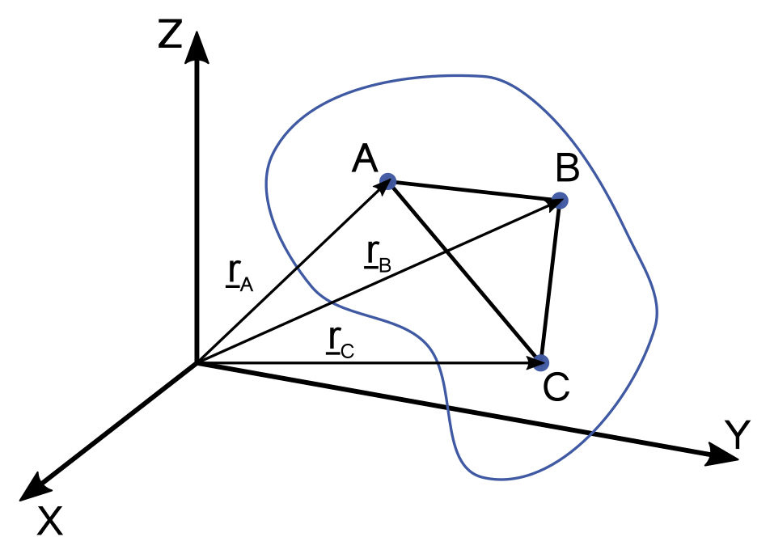
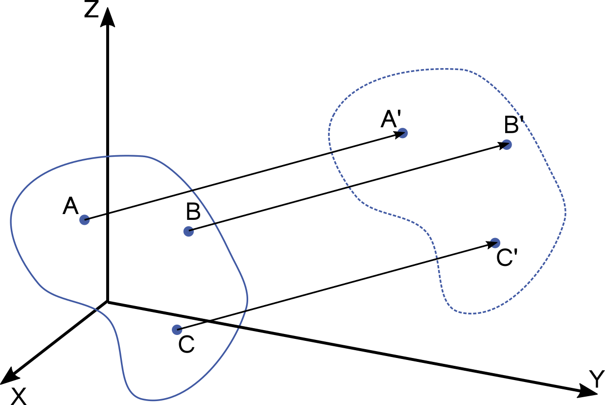
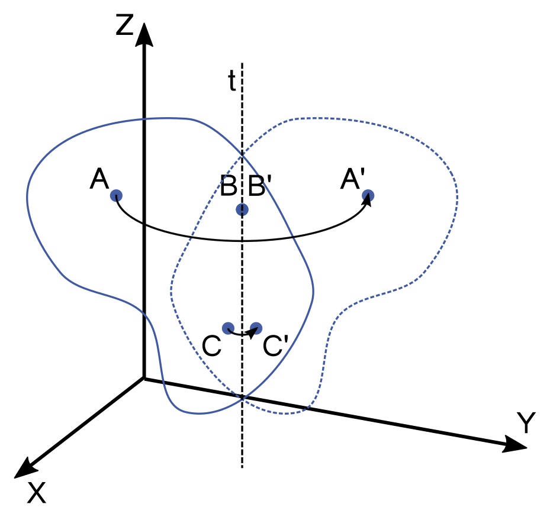
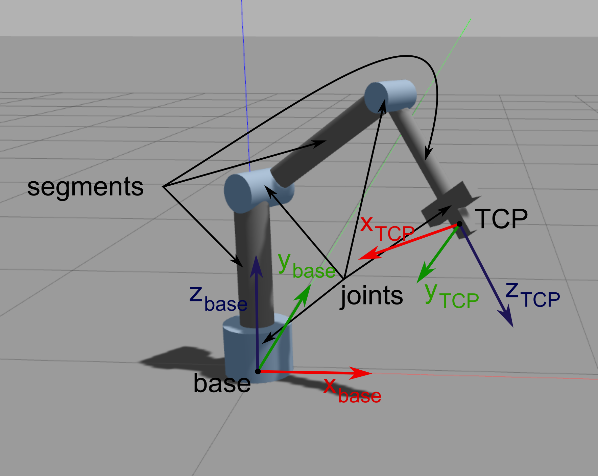
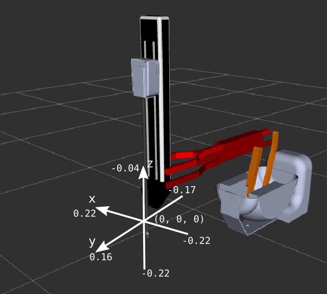

# Principles of robotics, programming a da Vinci surgical robot in a simulated environment, ROS1-ROS2 bridge
---

### Rigid body motion

---

{:style="width:200px" align=right}

!!! abstract "Def. Rigid body"
    A rigid body is defined as a body on which the distance between two points remains constant in time regardless of the force applied on it.


- Shape and the volume of the rigid bodies are also constant.
- The **pose** of a rigid body can be given by the three coordinates of three of its points that do not lie on the same straight line.

{:style="width:200px" align=right}

- The **pose** of a rigid body can be described in a more expressive way by the three coordinates of one of its points chosen arbitrarily **position** and the body's **orientation**.


- The **motion of rigid bodies** is composed by two elemental motions: **translation** and **rotation**.


-  During **translation**, all points of the body move along straight, parallel lines.

{:style="width:200px" align=right}

- During **rotation**, the position of the points of the rotational axis are constant, and the other points of the body move along circles in planes perpendicular to the axis of rotation.


- The **free motion** of rigid bodies can always be expressed  as the superposition of a translational motion and a rotation around a single axis.

---

### 3D transformations

---


- **Position:** 3D offset vector
  {:style="width:250px" align=right}
- **Orientation:** 3 x 3 rotation matrix
    - further orientation representations: Euler-angles, RPY, angle axis, quaternion

- **Pose**: 4 × 4 (homogenous) transformation matrix
- **Frame**: origin, 3 axes, 3 base vectors, right hand rule
- **Homogenous transformation:** rotation and translation in one transfromation
    - e.g., for the rotation $\mathbf{R}$ and translation $\mathbf{v}$:

$$
\mathbf{T} = \left[\matrix{\mathbf{R} & \mathbf{v}\\\mathbf{0} & 1 }\right] = \left[\matrix{r_{1,1} & r_{1,2} & r_{1,3} & v_x\\r_{2,1} & r_{2,2} & r_{2,3} & v_y\\r_{3,1} & r_{3,2} & r_{3,3} & v_z\\\ 0 & 0 & 0 & 1 }\right]
$$

- **Homogenous coordinates:**
    - **Vector:** extended with 0, $\mathbf{a_H}=\left[\matrix{\mathbf{a} \\ 0}\right]=\left[\matrix{a_x \\ a_y \\ a_z \\ 0}\right]$
    - **Point:** extended by 1, $\mathbf{p_H}=\left[\matrix{\mathbf{p} \\ 1}\right]=\left[\matrix{p_x \\ p_y \\ p_z \\ 1}\right]$
    - Applying transfomrations is much easier:

$$
\mathbf{q} = \mathbf{R}\mathbf{p} + \mathbf{v} \to \left[\matrix{\mathbf{q} \\ 1}\right] = \left[\matrix{\mathbf{R} & \mathbf{v}\\\mathbf{0} & 1 }\right]\left[\matrix{\mathbf{p} \\ 1}\right]
$$

- **Degrees of Freedom** (DoF): the number of independent parameters.

---

### Principles of robotics

---

{:style="width:400px" align=right}

- Robots are built of: **segments** (or links) és **joints**
- **Task space** (or cartesian space):
    - 3D space around us, where the task, endpoint trajectories, obstacles are defined.
    - **TCP** (Tool Center Point): Frame fixed to the end effector of the robot.
    - **Base frame**, **world frame**
- **Joint space**:
    -  Properties or values regarding the joints.
    -  Low-level controller.
    -  Joint angles, joint velocities, accelerations, torques....


---

### Python libraries

---

#### Numpy

---

- Python library
- High dimension arrays and matrices
- Mathematical functions

```python
import numpy as np

# Creating ndarrays
a = np.zeros(3)
a.shape
a.shape=(3,1)
a = np.ones(5)
a = np.empty(10)
l = np.linspace(5, 10, 6)
r = np.array([1,2])    # ndarray from python list
r = np.array([[1,2],[3,4]])
type(r)

# Indexing
l[0]
l[0:2]
l[-1]
r[:,0]

# Operations on ndarrays
r_sin = np.sin(r)
np.max(r)
np.min(r)
np.sum(r)
np.mean(r)
np.std(r)

l < 7
l[l < 7]
np.where(l < 7)

p = np.linspace(1, 5, 6)
q = np.linspace(10, 14, 6)

s = p + q
s = p * q
s = p * 10
s = p + 10
s = p @ q    # dot product
s = r.T
```

If not installed:

```bash
pip3 install numpy
```

#### Matplotlib

- Visualization in python
- Syntax similar to Matlab

```python
import numpy as np
from matplotlib import pyplot as plt

X = np.linspace(-np.pi, np.pi, 256)
C, S = np.cos(X), np.sin(X)

plt.plot(X, C)
plt.plot(X, S)

plt.show()
```

If not installed:

```bash
pip3 install matplotlib
```


---

## Practice

---


<iframe width="560" height="315" src="https://www.youtube.com/embed/QksAVT0YMEo" title="YouTube video player" frameborder="0" allow="accelerometer; autoplay; clipboard-write; encrypted-media; gyroscope; picture-in-picture" allowfullscreen></iframe>


---

### 1: ROS1-ROS2 bridge install

---

1. Open the `~/.bashrc` file and comment out the lines responsible
for source-coding ROS 1, ROS 2 and additional ROS workspaces.
    
    ---

2. Add the following line to the `~/.bashrc` file:

    ```bash
    export ROS_MASTER_URI=http://localhost:11311
    ```

    ---

3. Install the `ros-foxy-ros1-bridge` package:


    ```bash
    sudo apt update
    sudo apt install ros-foxy-ros1-bridge
    ```

---

### 2: Catkin workspace

---

1. Install the catkin build tools package:

    ```bash
    sudo apt update
    sudo apt-get install python3-catkin-tools python3-osrf-pycommon
    ```

    ---


2. Create the catkin workspace:

    ```bash
    mkdir -p ~/catkin_ws/src
    cd ~/catkin_ws
    catkin init
    ```

---


### 3: dVRK install

---

1. On Ubuntu 20.04 you will need the following packages:


    ```bash
    sudo apt install libxml2-dev libraw1394-dev libncurses5-dev qtcreator swig sox espeak cmake-curses-gui cmake-qt-gui git subversion gfortran libcppunit-dev libqt5xmlpatterns5-dev python3-wstool python3-catkin-tools python3-osrf-pycommon ros-noetic-rviz
    ```
    
    ---

2. Download the script that makes it easy to source ROS
versions (already downloaded on VMs). Source ROS 1:

    ```bash
    cd 
    source ros_setup.sh -v 1
    ```


3. Download and install the dVRK (da Vinci Reserach Kit):

    ```bash
    cd ~/catkin_ws                     # go in the workspace
    wstool init src                    # we're going to use wstool to pull all the code from github
    catkin config --cmake-args -DCMAKE_BUILD_TYPE=Release # all code should be compiled in release mode
    cd src                             # go in source directory to pull code
    wstool merge https://raw.githubusercontent.com/jhu-dvrk/dvrk-ros/master/dvrk_ros.rosinstall # or replace master by devel
    wstool up                          # now wstool knows which repositories to pull, let's get the code
    cd ~/catkin_ws
    catkin build --summary             # ... and finally compile everything
    ```

    !!! danger
        **Never** use `catkin build` and `catkin_make` in the same workspace!

    ---

4. Start the RViz simulation of PSM1 (Patient Side Manipulator). Do not forget to HOME on the dVRK console. Start the ROS1-ROS2 Bridge.
Study the simulator operation from ROS 2 using the learned prancs
(`ros2 topic list`, `ros2 topic echo` `ros2 run rqt_gui rqt_gui`, etc.).


    ```bash
    source ros_setup.sh -v 2
    ros2 topic list
    ros2 topic echo /PSM1/measured_cp
    ros2 run rqt_gui rqt_gui
    ```


    ```bash
    source ros_setup.sh -v 1
    roslaunch dvrk_robot dvrk_arm_rviz.launch arm:=PSM1 config:=/home/$(whoami)/catkin_ws/src/cisst-saw/sawIntuitiveResearchKit/share/console/console-PSM1_KIN_SIMULATED.json
    ```
   

    ```bash
    source ros_setup.sh -v b
    ros2 run ros1_bridge dynamic_bridge --bridge-all-topics
    ```


    ```bash
    source ros_setup.sh -v 2
    ros2 run rqt_gui rqt_gui
    ```

---


### 4: PSM subscriber

---

1. Create a new python source file named `psm_grasp.py` in `~/ros2_ws/src/ros2_course/ros2_course`.
Specify the new entry point in `setup.py` in the usual way.
    ---

2. Subscribe to topics that publish the TCP (Tool Center Point)
position of the PSM and the angle of the jaws of the tweezers.

    ```bash
    /PSM1/measured_cp
    /PSM1/jaw/measured_js
    ```
    
   ---

3. Build and run the node:

    ```bash
    source ros_setup.sh -v 2
    cd ~/ros2_ws
    colcon build --symlink-install
    ros2 run ros2_course psm_grasp 
    ```

    ---

### 5. Moving PSM TCP along a linear trajectory

---

{:style="width:350px" align=right}


1. The PSM expects the desired TCP position and the angle closed by the
jaws of the clamp in the topics below. Create publishers in `psm_grasp.py` for these topics.

    ```bash
    /PSM1/servo_cp
    /PSM1/jaw/servo_jp
    ```

    ---

2. Write a function that moves the TCP along a linear trajectory to the desired position.
Send the pin to position (0.0, 0.05, -0.12),
leave the orientation unchanged. The sampling time should be 0.01s. Using Matplotlib plot the planned trajectory
x, y and z components of the projected trajectory as a function of time.

    ```python
    def move_tcp_to(self, target, v, dt):
    ```

   {:style="width:700px" align=right}
    
   ---


3. Write a function to open and close the gripper, also using a linear trajectory.

    ```python
    def move_jaw_to(self, target, omega, dt):
    ```
    

    ---

### 6. Dummy marker

---

1. Create a new python source file named `dummy_marker.py`. Specify the entry point in `setup.py` in the usual way.
Implement a python program that publishes a marker with position (-0.05, 0.08, -0.14) in topic `dummy_target_marker`.
The value of the `frame_id` add tag should be `PSM1_psm_base_link`. Copy the following code into the file `dummy_marker.py`:
   
    ```python
    import rclpy
    from rclpy.node import Node
    from visualization_msgs.msg import Marker
    
    class DummyMarker(Node):
        def __init__(self, position):
            super().__init__('minimal_publisher')
            self.position = position
            self.publisher_ = self.create_publisher(Marker, 'dummy_target_marker', 10)
            timer_period = 0.1  # seconds
            self.timer = self.create_timer(timer_period, self.timer_callback)
            self.i = 0
            i = 0
    
        def timer_callback(self):
            marker = Marker()
            marker.header.frame_id = 'PSM1_psm_base_link'
            marker.header.stamp = self.get_clock().now().to_msg()
            marker.ns = "dvrk_viz"
            marker.id = self.i
            marker.type = Marker.SPHERE
            marker.action = Marker.MODIFY
            marker.pose.position.x = self.position[0]
            marker.pose.position.y = self.position[1]
            marker.pose.position.z = self.position[2]
            marker.pose.orientation.x = 0.0
            marker.pose.orientation.y = 0.0
            marker.pose.orientation.z = 0.0
            marker.pose.orientation.w = 1.0
            marker.scale.x = 0.008
            marker.scale.y = 0.008
            marker.scale.z = 0.008
            marker.color.a = 1.0 # Don't forget to set the alpha!
            marker.color.r = 0.0
            marker.color.g = 1.0
            marker.color.b = 0.0;
    
            self.publisher_.publish(marker)
            self.i += 1

    def main(args=None):
        rclpy.init(args=args)
        marker_publisher = DummyMarker([-0.05, 0.08, -0.12])
        rclpy.spin(marker_publisher)
    
        # Destroy the node explicitly
        # (optional - otherwise it will be done automatically
        # when the garbage collector destroys the node object)
        marker_publisher.destroy_node()
        rclpy.shutdown()
    
    if __name__ == '__main__':
        main()
    ```

    ---

2. Run the node and display the marker in RViz.

    ---

### 7. Grasping the marker

---

1. Subscribe to the topic sending the marker position in `psm_grasp.py`.

    ---

2. Modify `psm_grasp.py` to use the tweezers to grasp the generated marker.

   !!! note
       The simulator used has a tendency for certain values to get "stuck", so it is a good idea to reset the lever at the beginning of the program using the following lines: 
       ```python
       #Reset the arm
       psm.move_tcp_to([0.0, 0.0, -0.12], 0.01, 0.01)
       psm.move_jaw_to(0.0, 0.1, 0.01)
       ```


---

## USeful links

- [Download and compile dVRK](https://github.com/jhu-dvrk/sawIntuitiveResearchKit/wiki/CatkinBuild)
- [Marker examples](https://www.programcreek.com/python/example/88812/visualization_msgs.msg.Marker)
- [Numpy vector magnitude](https://numpy.org/doc/stable/reference/generated/numpy.linalg.norm.html)
- [Numpy linspace](https://numpy.org/doc/stable/reference/generated/numpy.linspace.html)


